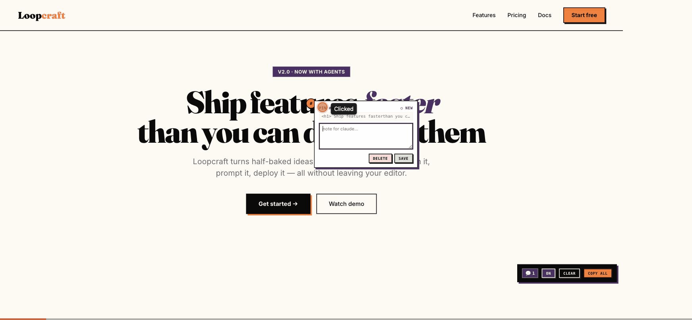

# feedback-to-cli

> Click-to-pin feedback on any localhost page. Feedback goes directly to your AI CLI, or option to copy as markdown.



You're vibe-coding with Claude Code, Cursor, or Copilot CLI. You see something off in the browser. Today you screenshot it, describe it in words, paste. Lossy. Slow.

`feedback-to-cli` collapses that to: **click on the thing → type a sentence → "copy all" → paste markdown back to your CLI.** **With the companion process, the paste step disappears too. Just let your AI CLI that you've dropped in feedback, then it reads and incorporates it.**

---

## Quick start (script tag)

```html
<script src="https://unpkg.com/feedback-to-cli@0"></script>
```

Drop that on any locally-served page. Click anywhere to pin. Toolbar bottom-right has on/off, clear, copy-all.

Pins persist in `localStorage` scoped to the pathname. Works in static HTML, Next.js dev, Vite dev, Astro dev — anything that renders HTML on localhost.

## Optional: companion server

```bash
npx feedback-to-cli serve
```

Or install it locally: `npm install -D feedback-to-cli` and run `npx feedback-to-cli serve` from a script.

Run from your project root. The overlay auto-detects it once at boot. Every save also writes to `.feedback-to-cli/<page-slug>.md` in the cwd, ready for your assistant to read directly.

```
.feedback-to-cli/
  home.md
  east-village_abc.md
```

> Tip: add `.feedback-to-cli/` to your project's `.gitignore` so pinned feedback doesn't end up in commits.

> Started the companion mid-session? Reload the page so the overlay picks it up.

> The companion only accepts requests from `localhost`, `127.0.0.1`, and `[::1]` origins. If your dev server is on a custom hostname (e.g. `my-app.test`), open it via `http://localhost:<port>` while using this tool — pins from other origins fall back to `localStorage` only and won't reach disk.

## Customization

Two `data-*` attributes on the script tag:

```html
<script
  src="https://unpkg.com/feedback-to-cli@0"
  data-namespace="my-app"
  data-companion-port="9091"
></script>
```

That's the whole API.

## Examples

- `examples/static-html/` — drop-in script tag
- `examples/nextjs/` — `app/layout.tsx` snippet
- `examples/vite/` — `index.html` snippet

## What lands in the clipboard

````md
# Feedback on /home

Total pins: 2

## Pin #1
**Target:** `<button> List Yours →`
**Note:**
```
make this primary, not ghost
```

## Pin #2
**Target:** `<h1> NYC's only short-term rental search…`
**Note:** _(empty)_
````

## License

MIT © Brooke Bekoff
